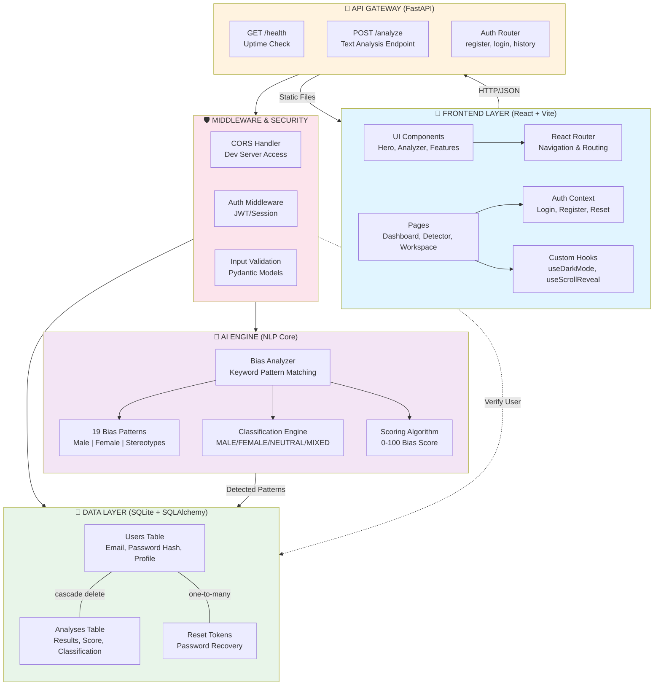

# GENTEK AI System Architecture

## System Overview

GENTEK is a **Gender Bias Detection AI System** that analyzes text for gender bias patterns using natural language processing and machine learning techniques.



---

## Core Components

| Component | Purpose | Technology | Location |
|-----------|---------|-----------|----------|
| **Frontend** | User interface, analysis input, results display | React 18, Tailwind CSS, Vite | `/src` |
| **API Gateway** | Request routing, endpoint management | FastAPI, CORS middleware | `/backend/main.py` |
| **AI Engine** | Gender bias detection & classification | Python NLP, keyword matching | `/backend/analyzer.py` |
| **Database** | User accounts, analysis history | SQLAlchemy ORM, SQLite | `/backend/models.py` |
| **Authentication** | User registration, login, password reset | bcrypt, JWT tokens | `/backend/auth.py` |

---

## AI Pipeline Flow

### Step-by-Step Analysis Process

```
1. INPUT
   └─ User submits text via POST /analyze endpoint

2. PATTERN DETECTION
   └─ Scan text for 19 predefined bias patterns
      • Male-biased: chairman, businessman, fireman, mailman, etc.
      • Female-biased: stewardess, housewife, spinster, etc.
      • Stereotypes: bossy, hysterical, nurturing, aggressive, etc.

3. COUNTING & CATEGORIZATION
   └─ Tally occurrences by bias type
      • Male count: # of male-biased words
      • Female count: # of female-biased words
      • Stereotype count: # of stereotypical terms

4. CLASSIFICATION
   └─ Assign bias category based on counts
      • MALE-BIASED: More male patterns detected
      • FEMALE-BIASED: More female patterns detected
      • MIXED-BIAS: Equal or mixed patterns
      • GENDER-NEUTRAL: No patterns detected

5. SCORING
   └─ Calculate 0-100 bias intensity score
      • Base: 40 points (if bias detected)
      • Per pattern: +15 points
      • Per stereotype: +8 points
      • Cap: 95 (max) to avoid false certainty

6. OUTPUT
   └─ Return to frontend
      • Detected patterns (with suggestions)
      • Classification label
      • Bias score
      • Highlighted HTML for visualization

7. PERSISTENCE
   └─ Save to Analysis table
      • User association
      • Text preview (label)
      • Full text storage
      • Timestamp
```

---

## Data Models

### User Table
```
{
  id: Integer (Primary Key),
  name: String(100),
  email: String(255, Unique),
  password: String(255) [bcrypt hash],
  created_at: DateTime,
  analyses: [Analysis] (One-to-Many relationship)
}
```

### Analysis Table
```
{
  id: Integer (Primary Key),
  user_id: Integer (Foreign Key → users.id),
  label: String(100) [first 48 chars of text],
  text: Text,
  score: Float [0-100],
  classification: String(50) [MALE-BIASED | FEMALE-BIASED | NEUTRAL | MIXED],
  created_at: DateTime,
  user: User (Relationship)
}
```

### PasswordResetToken Table
```
{
  id: Integer (Primary Key),
  user_id: Integer (Foreign Key → users.id),
  token: String(255, Unique),
  expires_at: DateTime,
  user: User (Relationship)
}
```

---

## API Endpoints

### Health Check
```http
GET /health
Response: { "status": "ok", "version": "1.0.0" }
```

### Analyze Text
```http
POST /analyze
Content-Type: application/json

Request:
{
  "text": "The chairman and his team of businessmen..."
}

Response:
{
  "detected": [
    {"word": "chairman", "type": "male", "suggestion": "chairperson", "reason": "..."},
    {"word": "businessmen", "type": "male", "suggestion": "business professionals", "reason": "..."}
  ],
  "male": 2,
  "female": 0,
  "stereotype": 0,
  "score": 70,
  "classification": "MALE-BIASED",
  "words": 15,
  "color": "#3B82F6"
}
```

### Authentication
```http
POST /auth/register
POST /auth/login
GET /auth/history
POST /auth/reset-password
```

---

## Technology Stack

### Frontend
- **React 18.3.1** - UI framework
- **Vite 5.4.8** - Build tool
- **Tailwind CSS 3.4.14** - Styling
- **React Router 6.26.1** - Navigation
- **Phosphor Icons** - Icon library

### Backend
- **FastAPI** - Web framework
- **SQLAlchemy** - ORM
- **SQLite** - Database
- **Pydantic** - Data validation
- **bcrypt** - Password hashing
- **Python 3** - Language

### Development
- **Concurrently** - Run API & UI together
- **PostCSS** - CSS processing
- **Autoprefixer** - CSS vendor prefixes

---

## File Structure

```
/Users/mac/GENTEK(1)/
├── backend/
│   ├── main.py              # FastAPI app entry point
│   ├── analyzer.py          # NLP bias analysis engine
│   ├── auth.py              # Authentication router
│   ├── database.py          # SQLAlchemy setup
│   ├── models.py            # ORM models (User, Analysis, Token)
│   └── requirements.txt     # Python dependencies
│
├── src/
│   ├── App.jsx              # Main app component
│   ├── main.jsx             # React entry point
│   ├── components/          # Reusable UI components
│   ├── pages/               # Page components
│   ├── context/             # Auth context
│   ├── hooks/               # Custom hooks
│   ├── data/                # Static data (plans, etc.)
│   └── utils/               # Helper functions
│
├── public/                  # Static assets
├── docs/                    # Documentation
├── package.json             # Frontend dependencies
├── vite.config.js           # Vite configuration
├── tailwind.config.js       # Tailwind configuration
└── postcss.config.js        # PostCSS configuration
```

---

## Running the System

### Development Mode
```bash
npm run dev
# Starts both API (port 8000) and UI (port 5173) concurrently
```

### Production Build
```bash
npm run serve
# Builds React app, then serves both API and static files
```

---

## Security Features

- ✅ **Password Hashing** - bcrypt with salt
- ✅ **CORS Protection** - Limited to localhost
- ✅ **Input Validation** - Pydantic models
- ✅ **Password Reset Tokens** - Time-limited recovery
- ✅ **JWT/Session Management** - User authentication
- ✅ **Cascade Delete** - User deletion removes all their analyses

---

## Future Enhancement Opportunities

1. **NLP Model Upgrades**
   - Replace keyword matching with transformer-based models (BERT, RoBERTa)
   - Add contextual bias detection (context-aware scoring)
   - Support multilingual analysis

2. **Database Scaling**
   - Migrate from SQLite to PostgreSQL
   - Add caching layer (Redis)
   - Implement database indexing for performance

3. **Deployment**
   - Docker containerization
   - Azure App Service / AWS Lambda deployment
   - CI/CD pipeline (GitHub Actions)

4. **Features**
   - Batch analysis API
   - Export reports (PDF, CSV)
   - API rate limiting
   - User analytics dashboard
   - Custom bias pattern configuration

---

**Last Updated:** 2026-07-01
