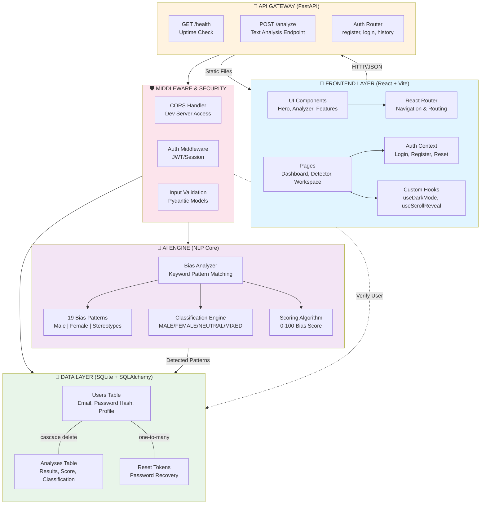

# GENTEK Architecture Diagram Prompt

## Prompt for AI Image/Diagram Generation

Copy and paste this prompt into any AI that can generate architecture diagrams (ChatGPT with DALL-E, Claude with image generation, Midjourney, etc.):

---

## PROMPT TO PASTE:

Create a comprehensive system architecture diagram for GENTEK, a Gender Bias Detection AI System. The diagram should show the following layers and components:

**LAYERS:**

1. **FRONTEND LAYER (React + Vite)** - Top layer, light blue background (#e1f5ff)
   - UI Components (Hero, Analyzer, Features sections)
   - Pages (Dashboard, Detector, Workspace)
   - Auth Context (Login, Register, Password Reset)
   - Custom Hooks (useDarkMode, useScrollReveal)
   - React Router for Navigation

2. **API GATEWAY (FastAPI)** - Orange background (#fff3e0)
   - GET /health endpoint (Uptime Check)
   - POST /analyze endpoint (Text Analysis)
   - Auth Router (register, login, history)

3. **AI ENGINE / NLP CORE** - Purple background (#f3e5f5)
   - Bias Analyzer (Keyword Pattern Matching)
   - 19 Bias Patterns database (Male | Female | Stereotypes)
   - Classification Engine (MALE-BIASED, FEMALE-BIASED, GENDER-NEUTRAL, MIXED-BIAS)
   - Scoring Algorithm (0-100 Bias Score)

4. **DATA LAYER** - Green background (#e8f5e9)
   - Users Table (Email, Password Hash, Profile)
   - Analyses Table (Results, Score, Classification)
   - Reset Tokens Table (Password Recovery)
   - Show cascade delete relationship from Users to Analyses

5. **MIDDLEWARE & SECURITY** - Pink background (#fce4ec)
   - CORS Handler (Dev Server Access)
   - Auth Middleware (JWT/Session)
   - Input Validation (Pydantic Models)

**CONNECTIONS:**
- Frontend connects to API Gateway via HTTP/JSON
- API Gateway connects to Middleware
- Middleware connects to AI Engine and Database
- AI Engine returns detected patterns to Database
- API Gateway serves Static Files back to Frontend
- Middleware verifies users against Database

**STYLE REQUIREMENTS:**
- Professional, tech company style
- Color-coded layers as specified
- Clear arrows showing data flow
- Include emoji indicators (🎨, 🔗, 🧠, 💾, 🛡️)
- Modern, minimalist design
- Enterprise-grade appearance

**OUTPUT:**
Generate a clean, professional architecture diagram that can be used for:
- Developer documentation
- Technical presentations
- Team onboarding
- GitHub repository documentation

---

## Text-Based Mermaid Version (If you need code):

---

**System Description for AI Context:**

GENTEK is a Gender Bias Detection platform that analyzes text for gender bias patterns. It uses NLP-based keyword pattern matching to identify:
- Male-biased words (chairman, businessman, fireman, policeman, mailman, congressman, etc.)
- Female-biased words (stewardess, housewife, spinster, lady doctor, girl boss, etc.)
- Stereotypical terms (bossy, hysterical, overly emotional, aggressive, nurturing)

The system classifies analyzed text as MALE-BIASED, FEMALE-BIASED, MIXED-BIAS, or GENDER-NEUTRAL, and assigns a 0-100 bias score.

Users can register, login, submit text for analysis, view results, and access their analysis history.

---

End of Prompt
